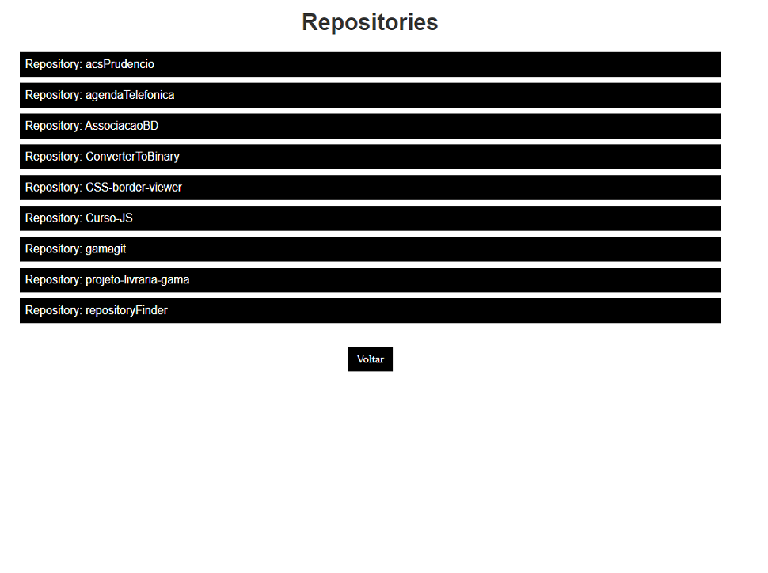

# Buscador de repositórios 

Este projeto foi desenvolvido durante o módulo de react no programa Hiring Coders
## Aplicação

O objetivo dessa aplicação é buscar todos os repositórios de um usuário dentro do github.
Para usa-la é bem simples, basta inserir o nome do usuário no campo indicado e clicar no botão de pesquisar.




## Usando a aplicação
Para usá-la, basta executar os seguintes comandos na raíz do projeto:
```
npm install
npm start
```

ou

```
yarn install
yarn start
```